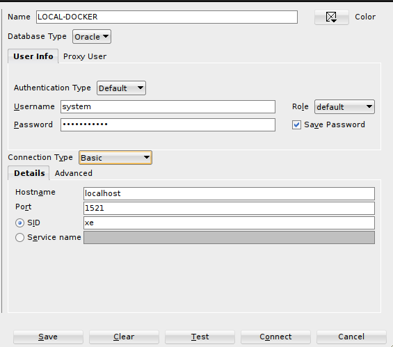

[![MIT License][license-shield]][license-url]

## Pre-requisites
<ul>
  <li><a href="https://docs.docker.com/compose/install/">Docker and Docker compose</a></li>
  <li><a href="https://www.docker.com/products/docker-desktop/">Docker Desktop (Optional but recommended)</a></li>
</ul>

## Installation
1. Clone the repo
   ```sh
    git clone https://github.com/root-hunter/oracle-db.git
    ```
2. Move to directory
   ```sh
   cd oracle-db
   ```
3. Start container deamon
   ```sh
   docker compose up -d
   ```

## Connection
We use <a href="https://www.oracle.com/database/sqldeveloper/technologies/download/">Sql Developer</a>.

### 1. Access to database (default pass: password123)

<br />

<br />

### 2. Add DBA

<br />

<br />

[license-shield]: https://img.shields.io/github/license/othneildrew/Best-README-Template.svg?style=for-the-badge
[license-url]: https://github.com/root-hunter/oracle-db/blob/master/LICENSE
